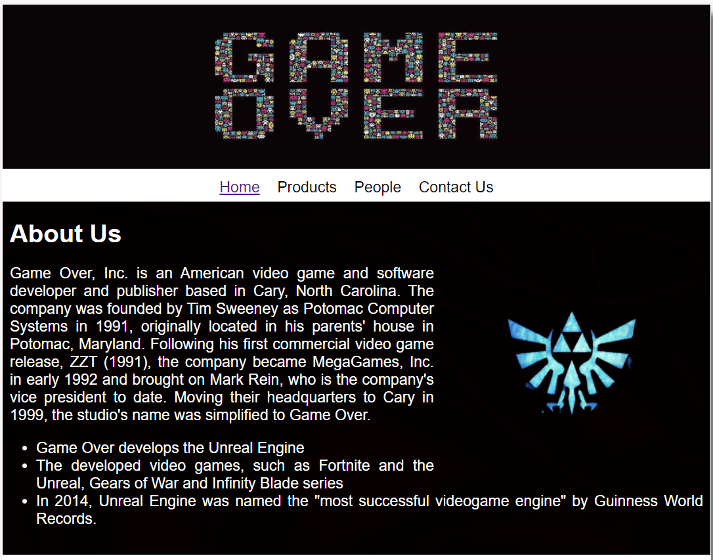
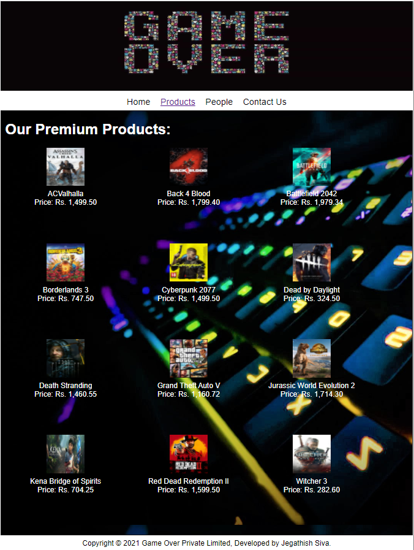
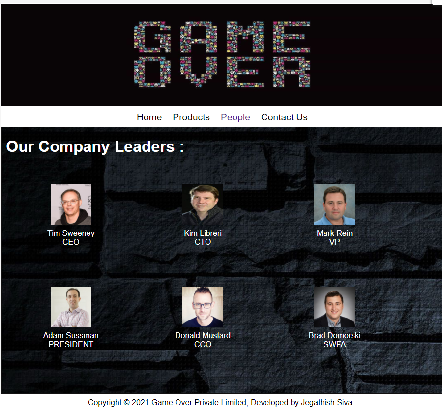
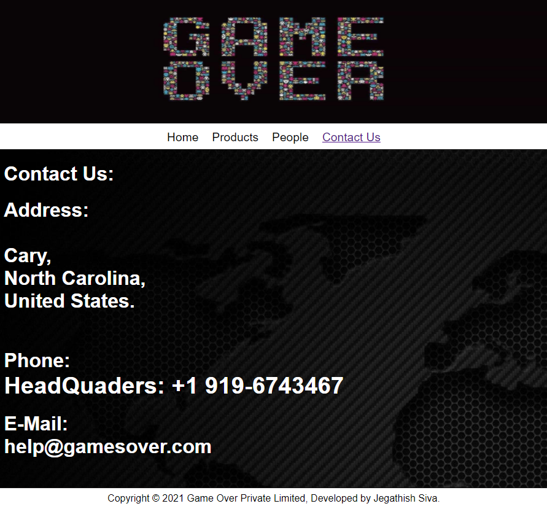

# Web Design for a Software Product Company

## AIM:

To design a static website for a software product company company.

## DESIGN STEPS:

### Step 1:

Requirement collection.

### Step 2:

Creating the layout using HTML and CSS.

### Step 3:

Updating the sample content.

### Step 4:

Choose the appropriate style and color scheme.

### Step 5:

Validate the layout in various browsers.

### Step 6:

Validate the HTML code.

### Step 6:

Publish the website in the given URL.

## PROGRAM :
layout.css
```
* {
  box-sizing: border-box;
  font-family: Arial, Helvetica, sans-serif;
}
body {
  background-color: whitesmoke;
  color: white;
  font-family: Impact, Haettenschweiler, 'Arial Narrow Bold', sans-serif;
  font-size: larger;
}
.container {
  width: 1080px;
  margin-left: auto;
  margin-right: auto;
  border-width: 1px 1px 1px 1px;
  border-style: solid;
  box-shadow: 15px 15px 8px gray;
}

.banner {
  display: block;
  width: 100%;
  height: 250px;
  text-align: center;
  font-size: 60px;
  background-image: url("/static/img/img4.jpg");
  background-size: 100% 100%;
  margin: 0px 0px 0px 0px;
  padding-top: 150px;
  color: #16d1ae;
}

.menu {
  display: block;
  width: 100%;
  height: 50px;
  font-size: larger;
  background-color: white;
  text-align: center;
  padding-top: 15px;
  margin: 0px 0px 0px 0px;
  border-width: 1px;
}

.menuitem {
  display: inline-block;
  margin-left: 10px;
  margin-right: 10px;
}
.menuitemselected {
  display: inline-block;
  margin-left: 10px;
  margin-right: 10px;
  color: #16d1ae;
}

.menuitem a {
  text-decoration: none;
  color: rgb(0, 0, 0);
}

.content {
  display: block;
  width: 100%;
  background-image: url("/static/img/img11.jpg");
  min-height: 500px;
  margin: 0px 0px 0px 0px;
  border-width: 1px;
  border-color: rgb(17, 16, 16);
  border-style: solid;
}
.back {
  display: block;
  width: 100%;
  background-image: url("/static/img/img14.jpg");
  min-height: 500px;
  margin: 0px 0px 0px 0px;
  border-width: 1px;
  border-color: rgb(17, 16, 16);
  border-style: solid;
}
.product1 {
  display: block;
  width: 100%;
  background-image: url("/static/img/front2.jpg");
  min-height: 500px;
  margin: 0px 0px 0px 0px;
  border-width: 1px;
  border-color: rgb(17, 16, 16);
  border-style: solid;
}
.contactus {
  display: block;
  width: 100%;
  background-image: url("/static/img/img12.jpg");
  min-height: 500px;
  margin: 0px 0px 0px 0px;
  border-width: 1px;
  border-color: rgb(17, 16, 16);
  border-style: solid;
}
.homecontent {
  min-height: 500px;
  margin: 10px 10px 10px 10px;
}
.homecontent h1 {
  text-align: left;
}
.homecontent img {
  float: right;
  width: 400px;
  height: 300px;
  margin-left: 10px;
}

.contenttext {
  text-align: justify;
  color: white;
  font-size:larger;
}

.productcontent {
  min-height: 500px;
  margin: 10px 10px 10px 10px;
}

.productcontent h1 {
  text-align: left;
}

.productitems {
  display: block;
}

.productitem {
  display: inline-block;
  width: 30%;
  height: 250px;
  text-align: center;
}

.productitem img {
  width: 100px;
  height: 100px;
  display: block;
}
.productitem .itemimage {
  display: inline-block;
  margin-left: auto;
  margin-right: auto;
  width: 100px;
  margin-bottom: 5px;
}

.productitem .itemname {
  display: block;
}
.productitem .itemprice {
  display: block;
}

.footer {
  display: block;
  width: 100%;
  height: 40px;
  background-color: white;
  text-align: center;
  padding-top: 10px;
  margin: 0px 0px 0px 0px;
  color: rgb(0, 0, 0);
}
```
Home page
```
<!DOCTYPE html>
<html lang="en">
  <head>
    <title>EduSoft Private Limited</title>
    <link rel="stylesheet" href="./css/layout.css" />
    <link rel="icon" href="./img/icon.png" type="image/x-icon" />
  </head>
  
  <body>
    <div class="container">
      <div class="banner"></div>
      <div class="menu">
        <div class="menuitemselected"><a href="/static/home.html">Home</a></div>
        <div class="menuitem"><a href="/static/products.html">Products</a></div>
        <div class="menuitem"><a href="/static/people.html">People</a></div>
        <div class="menuitem"><a href="/static/contactus.html">Contact Us</a></div>
        </div>
      <div class="content">
        <div class="homecontent">
          <h1>About Us</h1>
          
          <div class="contenttext">
            Game Over, Inc. is an American video game and software developer and publisher based in Cary, North Carolina. 
The company was founded by Tim Sweeney as Potomac Computer Systems in 1991, originally located in his parents' house in Potomac, Maryland. 
Following his first commercial video game release, ZZT (1991), the company became MegaGames, Inc. 
in early 1992 and brought on Mark Rein, who is the company's vice president to date. 
Moving their headquarters to Cary in 1999, the studio's name was simplified to Game Over.
            <ul>
              <li>Game Over develops the Unreal Engine</li>
              <li>The developed video games, such as Fortnite and the Unreal, Gears of War and Infinity Blade series</li>
              <li>In 2014, Unreal Engine was named the "most successful videogame engine" by Guinness World Records.</li>
            </ul>
          </div>
        </div>
      </div>
      <div class="footer">
        Copyright &#169; 2021 Game Over Private Limited, Developed by Jegathish siva.
      </div>
    </div>
  </body>
</html>
```
Product page
```
<!DOCTYPE html>
<html lang="en">
  <head>
    <title>EduSoft Private Limited</title>
    <link rel="stylesheet" href="./css/layout.css" />
    <link rel="icon" href="./img/icon.png" type="image/x-icon" />
  </head>
  
  <body>
    <div class="container">
      <div class="banner"></div>
      <div class="menu">
        <div class="menuitem"><a href="/static/home.html">Home</a></div>
        <div class="menuitemselected"><a href="/static/products.html">Products</a></div>
        <div class="menuitem"><a href="/static/people.html">People</a></div>
        <div class="menuitem"><a href="/static/contactus.html">Contact Us</a></div>
        </div>
      <div class="product1">
        <div class="productcontent">    
          <h1>Our Premium Products:</h1>
          <div class="productitems">
              <div class="productitem"> 
                  <div class="itemimage">
                  
                  </div>
                  <div class="itemname">ACValhalla</div>
                  <div class="itemprice">Price: Rs. 1,499.50 </div>
              </div>
              <div class="productitem"> 
                  <div class="itemimage">
                  
                  </div>
                  <div class="itemname">Back 4 Blood</div>
                  <div class="itemprice">Price: Rs. 1,799.40 </div>
              </div>
              <div class="productitem"> 
                  <div class="itemimage">
                  
                  </div>
                  <div class="itemname">Battlefield 2042</div>
                  <div class="itemprice">Price: Rs. 1,979.34 </div>
               </div>
               <div class="productitem"> 
                  <div class="itemimage">
                  
                  </div>
                  <div class="itemname">Borderlands 3</div>
                  <div class="itemprice">Price: Rs. 747.50 </div>
               </div>
               <div class="productitem"> 
                  <div class="itemimage">
                  
                  </div>
                  <div class="itemname">Cyberpunk 2077</div>
                  <div class="itemprice">Price: Rs. 1,499.50 </div>
               </div>
               <div class="productitem"> 
                  <div class="itemimage">
                  
                  </div>
                  <div class="itemname">Dead by Daylight</div>
                  <div class="itemprice">Price: Rs. 324.50 </div>
               </div>
               <div class="productitem"> 
                  <div class="itemimage">
                  
                  </div>
                  <div class="itemname">Death Stranding</div>
                  <div class="itemprice">Price: Rs. 1,460.55 </div>
               </div>
               <div class="productitem"> 
                  <div class="itemimage">
                  
                  </div>
                  <div class="itemname">Grand Theft Auto V</div>
                  <div class="itemprice">Price: Rs. 1,160.72 </div>
                </div>
                <div class="productitem"> 
                  <div class="itemimage">
                  
                  </div>
                  <div class="itemname">Jurassic World Evolution 2</div>
                  <div class="itemprice">Price: Rs. 1,714.30 </div>
                </div>
                <div class="productitem"> 
                  <div class="itemimage">
                  
                  </div>
                  <div class="itemname">Kena Bridge of Spirits</div>
                  <div class="itemprice">Price: Rs. 704.25 </div>
                </div>
                <div class="productitem"> 
                  <div class="itemimage">
                  
                  </div>
                  <div class="itemname">Red Dead Redemption II</div>
                  <div class="itemprice">Price: Rs. 1,599.50 </div>
                </div>
                <div class="productitem"> 
                  <div class="itemimage">
                  
                  </div>
                  <div class="itemname">Witcher 3</div>
                  <div class="itemprice">Price: Rs. 282.60 </div>
                </div>
          </div>
          </div>        
      </div>
      <div class="footer">
        Copyright &#169; 2021 Game Over Private Limited, Developed by Jegathish Siva.
      </div>
    </div>
  </body>
</html>
```
People page
```
<!DOCTYPE html>
<html lang="en">
  <head>
    <title></title>
    <link rel="stylesheet" href="./css/layout.css" />
    <link rel="icon" href="./img/ail.png" type="image/x-icon" />
    </head>
    <body>
    <div class="container">
      <div class="banner"></div>
      <div class="menu">
        <div class="menuitem"><a href="/static/home.html">Home</a></div>
        <div class="menuitem"><a href="/static/products.html">Products</a></div>
        <div class="menuitemselected"><a href="/static/people.html">People</a></div>
        <div class="menuitem"><a href="/static/contactus.html">Contact Us</a></div>
        </div>
      <div class="back">
        <div class="homecontent">
          <h1>Our Company Leaders :</h1><br><br>
          <div class="productitems">
            <div class="productitem"> 
                <div class="itemimage">
                
                </div>
                <div class="itemname">Tim Sweeney</div>
                <div class="itemprice">CEO</div>
            </div>
            <div class="productitem"> 
                <div class="itemimage">
                
                </div>
                <div class="itemname">Kim Libreri</div>
                <div class="itemprice">CTO</div>
            </div>
            <div class="productitem"> 
              <div class="itemimage">
              
              </div>
              <div class="itemname">Mark Rein</div>
              <div class="itemprice">VP</div>
            </div>
            <div class="productitem"> 
              <div class="itemimage">
              
              </div>
              <div class="itemname">Adam Sussman</div>
              <div class="itemprice">PRESIDENT</div>
          </div>
          <div class="productitem"> 
            <div class="itemimage">
            
            </div>
            <div class="itemname">Donald Mustard</div>
            <div class="itemprice">CCO</div>
        </div>  <div class="productitem"> 
          <div class="itemimage">
          
          </div>
          <div class="itemname">Brad Domorski</div>
          <div class="itemprice">SWFA</div>
      </div>
          </div>
        </div>
        </div>        
    </div>
    <div class="footer">
      Copyright &#169; 2021 Game Over Private Limited, Developed by Jegathish Siva .
    </div>
   </div>
</body>
</html>
```
Contactus Page
```
<!DOCTYPE html>
<html lang="en">
  <head>
    <title></title>
    <link rel="stylesheet" href="./css/layout.css" />
    <link rel="icon" href="./img/ail.png" type="image/x-icon" />
  </head>

  <body>
    <div class="container">
      <div class="banner"></div>
      <div class="menu">
        <div class="menuitem"><a href="/static/home.html">Home</a></div>
        <div class="menuitem"><a href="/static/products.html">Products</a></div>
        <div class="menuitem"><a href="/static/people.html">People</a></div>
        <div class="menuitemselected"><a href="/static/contactus.html">Contact Us</a></div>
      </div>
      <div class="contactus">
        <div class="homecontent">
          <h1>Contact Us:</h1>
          <h1>Address:<br>
           <br> Cary, 
           <br>North Carolina, 
           <br>United States.</h1>
          <div class="contenttext1">
            
          </div><br>
          <h1>Phone:
          <div class="contenttext">
              HeadQuaders: +1 919-6743467
          </div>
          <h1>E-Mail:
            <br> help@gamesover.com </h1><br>
          <div class="contenttext">
             
          </div>
        </div>
      </div>
      <div class="footer">
        Copyright &#169; 2021 Game Over Private Limited, Developed by Jegathish Siva.
      </div>
    </div>
  </body>
</html>
```

## OUTPUT:

### Home Page:



### Product Page:



### People Page:



### Contact Us:



## Result:

Thus a website is designed for the software product company and the HTML,CSS code are validated.
